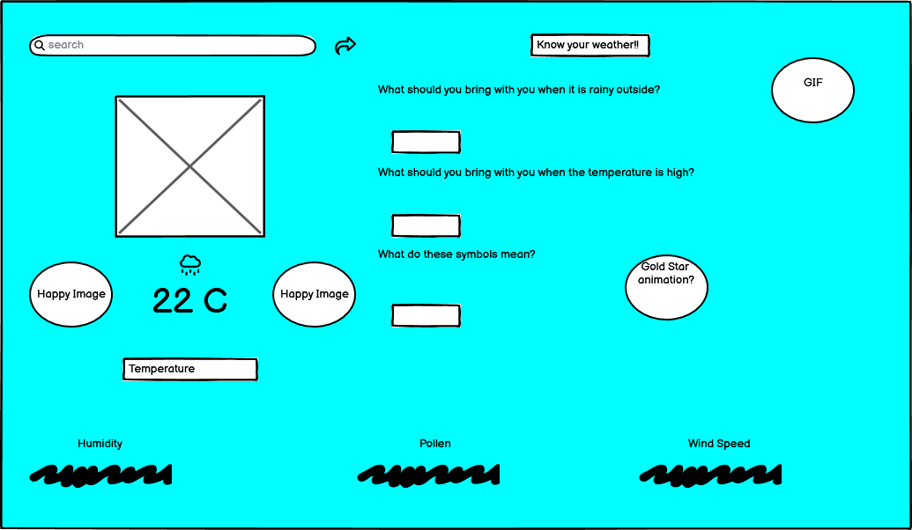
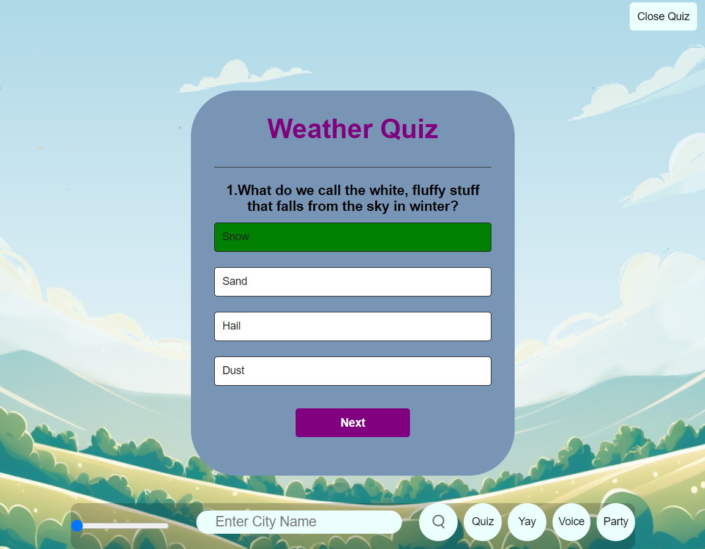

# Project Title: Weather Report Junior

Our website is designed to provide users with a website with information regarding the weather and educational content for learning about the weather. This project combines an educational resource and a practical application that will teach children about how to prepare for the weather as well as information on the current weather anywhere in the world.

## Team Members

- [Mel] - Team Lead
- [Archana] - Developer
- [Joe] - Developer
- [Tadhg] - Developer

## Technologies Used

- Github
- Gitpod
- JavaScript
- HTML
- CSS
- API
- Favicon: https://favicon.io/
- ChatGPT: https://chat.openai.com
- Midjourney AI: https://www.midjourney.com 

# Ideation

## Initial Idea

We agreed from the offset to attempt to build a website using an API for weather reports. Upon reviewing the options presented for the Hackathon we decided to incorporate a quiz into the project in order to meet the specificity of the given briefs. Thus we decided to approach the project with the aim of making an educational app for children that would both provide them with information regarding the weather as well as a supplemental quiz to teach them more about safety and the weather itself. This gave us a unified direction to take the website aesthetically and functionally as the project now had a target audience for children. When the weather app was also made available as a brief we were able to roll two project ideas into one while still keeping it completely coherent in theme and purpose.

## User Stories

Our initial User Stories were considered from a general perspective:

As a user, I want to be able to enter a city name in a search box to get the current weather information for that city.
As a user, I want to see the temperature displayed in Celsius for the selected city.
As a user, I want to know the weather description (e.g., cloudy, sunny, rainy) for the selected city.
As a user, I want to see an icon representing the current weather conditions for the selected city.
As a user, I want to know the humidity level for the selected city.

As a user, I want to know the wind speed for the selected city.
As a user, I want to receive an error message if the entered city is not found.
As a user, I want to see a visually appealing background gradient that changes based on the time of day.
As a user, I want the background color to reflect the weather conditions (e.g., blue for clear sky, gray for clouds).
As a user, I want to hear the weather information being spoken out loud using text-to-speech functionality.

As a user, I want to see an error message if there is an issue fetching the weather data.
As a user, I want the application to display the local time for the selected city.
As a user, I want the background color to change dynamically based on the local time.
As a user, I want to click a button to activate a rave mode that changes the background color rapidly.
As a user, I want the application to display an error message if the entered city is not valid.

As a user, I want the background gradient to smoothly transition between colors.
As a user, I want the option to turn off the background music during rave mode.
As a user, I want to see the current weather conditions updated when I search for a different city.
As a user, I want to see a loading indicator while the weather data is being fetched.
As a user, I want the application to remember my recently searched cities for quick access.

Later user stories were considered for the new target audience:

As a user, I want my child to be entertained.
As a user, I want my child to receive an educational benefit.
As a user, I want the website to have a practical purpose.
As a user, I want the website to be encouraging for children to use.
As a user, I want my child to be able to understand to the product or be able to easily learn to.

## Wireframe

Our early wireframe idea was ambitious at the time but ultimately ended up being less compact and pleasing to the eye than the finished product.

The second wireframe was made when we first decided to pursue the idea of making a website aimed at children.

## Introduction

Our project uses API through JavaScript to report the weather alongside a child friendly quiz with practical questions to promote safety in all kinds of weather. The project incorporates HTML, CSS, and JavaScript to create an easy to use, responsive product that is appealling to children.

You can use the website to fetch weather reports on anywhere in the world. You can also take a quiz of 20 questions aimed at children about the weather and how to prepare for it. We aimed to create a cohesive theme and aesthetic that is both fun and practical and that challenges us to make use of the skills we have acquired so far as programmers.

## Features

HTML and CSS has been used to create an attractive, easy to read and responsive home page.

Search function to allow the user to search for geographical locations and receive information about the weather, temperature, humidity, pollen, and wind speed in that area.

A clear JavaScript implemented weather report that immediately draws the eye when accessing the site and provides the initial function of the weather API at a single glance.

Fully implemented quiz with text reader for children of young ages to both use and learn.

Sound implementation to provide positive feedback for young users to encourage them.

Responsive Design: The website is designed to be accessible and visually appealing across various devices.

Easy-to-Use Interface: Easy navigation and use of popups for a seamless user experience.

### Bugs
Our foreground image disappeared on multiple occasions. This was resolved each time with a quick review of the code.

One of the culprits for its disappearance was changes to image pathing due to different assets in different folders across repo branches. These issues often caused confusion but were quickly ammended when understood.

Efforts were made to incorporate background images into the quiz each unique and themed to different questions. Though we sourced enough images and implemented them through Javascript, issues with CSS and the foreground image led to this feature being scrapped.

An early attempt to implement Bootstrap caused issues with existing CSS and ultimately Bootstrap was scrapped.

## Website Images

## Presentation Slides
TBI

## Link to Website
TBI

## How to Use

Open the website address in your web browser.

Use the search bar to type a location and recieve weather information.

Click the pop up to access the quiz.

Answer the multiple choice questions the work through the quiz and recieve a score and sound based user feedback as you go.

## Ideas for Future Implementation

Ideally we would expand upon the features already present within the app including themed backgrounds for each question in the quiz, further text to speech capability in the form of a compliment every time a user correctly answers a question, animated icons, and more sounds and graphics to entertain children while they learn. We also wished to implement a Dark Mode but settled for a slider for the home page which serves a similar purpose. We also would also have liked to implement semi-transparent overlays for different weather reports such as a rain or snow animation.